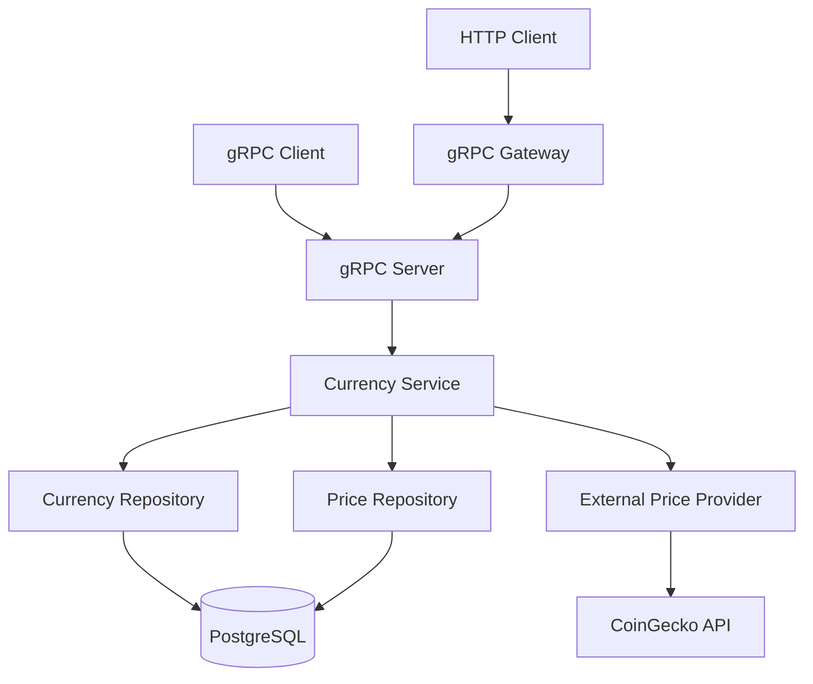

# Crypto Currency Service API Documentation

## Обзор

Crypto Currency Service - это высокопроизводительный микросервис для управления и отслеживания криптовалют, построенный с использованием gRPC и Clean Architecture. Сервис предоставляет как gRPC, так и HTTP REST интерфейсы через gRPC Gateway.

## Архитектура сервиса

### Схема архитектуры



### Слои архитектуры

1. **Presentation Layer**: gRPC handlers, HTTP Gateway
2. **Application Layer**: Business services, use cases
3. **Domain Layer**: Entities, domain logic, ports
4. **Infrastructure Layer**: Repositories, external integrations

## API Reference

### Base URLs

- **HTTP REST API**: `http://localhost:8080`
- **gRPC API**: `localhost:9090`
- **Swagger UI**: `http://localhost:8081/swagger/`

## HTTP REST API

### Authentication

В текущей версии аутентификация не требуется. Все эндпоинты доступны публично.

### Error Responses

Все ошибки возвращаются в едином формате:

```json
{
  "code": 14,
  "message": "external service unavailable"
}
```

#### Коды ошибок

| HTTP Code | gRPC Code | Описание |
|-----------|-----------|----------|
| 400 | 3 | Неверные параметры запроса |
| 404 | 5 | Ресурс не найден |
| 409 | 6 | Конфликт (дубликат) |
| 500 | 13 | Внутренняя ошибка сервера |
| 503 | 14 | Внешний сервис недоступен |


### Запуск сервиса в docker

В корне репозитория запустить

```bash
docker-compose up --build -d
```
и дождаться запуска всех контейнеров
---

### Endpoints

#### GET /api/v1/currencies

Получение списка всех отслеживаемых криптовалют.

**Parameters**: Нет

**Response**:
```json
{
  "currencies": [
    {
      "id": "1",
      "symbol": "BTC",
      "name": "Bitcoin",
      "createdAt": "2025-08-07T19:49:53.884614Z",
      "updatedAt": "2025-08-07T19:49:53.884614Z"
    }
  ]
}
```

**Example Request**:
```bash
curl -X GET http://localhost:8080/api/v1/currencies \
  -H "Accept: application/json"
```

---

#### POST /api/v1/currency

Добавление новой криптовалюты в список отслеживания.

**Request Body**:
```json
{
  "symbol": "BTC",
  "name": "Bitcoin"
}
```

**Parameters**:
- `symbol` (string, required): Символ криптовалюты (например: BTC, ETH)
- `name` (string, required): Полное название криптовалюты

**Response**:
```json
{
  "currency": {
    "id": "1",
    "symbol": "BTC",
    "name": "Bitcoin",
    "createdAt": "2025-08-07T19:49:53.884614Z",
    "updatedAt": "2025-08-07T19:49:53.884614Z"
  }
}
```

**Example Request**:
```bash
curl -X POST http://localhost:8080/api/v1/currency \
  -H "Content-Type: application/json" \
  -d '{"symbol": "BTC", "name": "Bitcoin"}'
```

**Possible Errors**:
- `400`: Пустой символ или название
- `409`: Валюта уже существует

---

#### DELETE /api/v1/currency/{symbol}

Удаление криптовалюты из списка отслеживания.

**Path Parameters**:
- `symbol` (string, required): Символ криптовалюты для удаления

**Response**: 
```json
{}
```

**Example Request**:
```bash
curl -X DELETE http://localhost:8080/api/v1/currency/BTC
```

**Possible Errors**:
- `404`: Валюта не найдена

---

#### GET /api/v1/currency/{symbol}/price

Получение текущей цены криптовалюты.

**Path Parameters**:
- `symbol` (string, required): Символ криптовалюты

**Query Parameters**:
- `timestamp` (string, optional): Временная метка в ISO 8601 формате

**Response**:
```json
{
  "price": {
    "id": "1",
    "symbol": "BTC",
    "price": 45000.50,
    "timestamp": "2025-08-07T20:15:30.123456Z"
  }
}
```

**Example Request**:
```bash
curl -X GET http://localhost:8080/api/v1/currency/BTC/price
```

**Possible Errors**:
- `404`: Валюта не найдена
- `503`: Внешний сервис недоступен

---

#### GET /api/v1/currency/{symbol}/history

Получение исторических данных о ценах криптовалюты.

**Path Parameters**:
- `symbol` (string, required): Символ криптовалюты

**Query Parameters**:
- `startTime` (string, optional): Начальное время в ISO 8601 формате
- `endTime` (string, optional): Конечное время в ISO 8601 формате  
- `limit` (integer, optional): Максимальное количество записей (по умолчанию: 100)

**Response**:
```json
{
  "prices": [
    {
      "id": "1",
      "symbol": "BTC",
      "price": 45000.50,
      "timestamp": "2025-08-07T20:15:30.123456Z"
    },
    {
      "id": "2", 
      "symbol": "BTC",
      "price": 44500.25,
      "timestamp": "2025-08-06T20:15:30.123456Z"
    }
  ]
}
```

**Example Requests**:
```bash
# Получить последние 10 записей
curl -X GET "http://localhost:8080/api/v1/currency/BTC/history?limit=10"

# Получить данные за период
curl -X GET "http://localhost:8080/api/v1/currency/BTC/history?startTime=2025-08-01T00:00:00Z&endTime=2025-08-07T23:59:59Z&limit=50"
```

**Possible Errors**:
- `404`: Валюта не найдена
- `400`: Неверные параметры времени
- `503`: Внешний сервис недоступен

## gRPC API

### Service Definition

```protobuf
syntax = "proto3";

package currency.v1;

service CurrencyService {
  rpc AddCurrency(AddCurrencyRequest) returns (CurrencyResponse);
  rpc RemoveCurrency(RemoveCurrencyRequest) returns (google.protobuf.Empty);
  rpc GetCurrencyPrice(GetCurrencyPriceRequest) returns (CurrencyPriceResponse);
  rpc ListCurrencies(google.protobuf.Empty) returns (ListCurrenciesResponse);
  rpc GetPriceHistory(GetPriceHistoryRequest) returns (PriceHistoryResponse);
}
```

### Message Types

#### Currency
```protobuf
message Currency {
  int64 id = 1;
  string symbol = 2;
  string name = 3;
  google.protobuf.Timestamp created_at = 4;
  google.protobuf.Timestamp updated_at = 5;
}
```

#### CurrencyPrice
```protobuf
message CurrencyPrice {
  int64 id = 1;
  string symbol = 2;
  double price = 3;
  google.protobuf.Timestamp timestamp = 4;
}
```

### gRPC Methods

#### AddCurrency

```protobuf
rpc AddCurrency(AddCurrencyRequest) returns (CurrencyResponse);

message AddCurrencyRequest {
  string symbol = 1;
  string name = 2;
}

message CurrencyResponse {
  Currency currency = 1;
}
```

**Example**:
```bash
grpcurl -plaintext -d '{"symbol":"BTC","name":"Bitcoin"}' \
  localhost:9090 currency.v1.CurrencyService.AddCurrency
```

#### RemoveCurrency

```protobuf
rpc RemoveCurrency(RemoveCurrencyRequest) returns (google.protobuf.Empty);

message RemoveCurrencyRequest {
  string symbol = 1;
}
```

**Example**:
```bash
grpcurl -plaintext -d '{"symbol":"BTC"}' \
  localhost:9090 currency.v1.CurrencyService.RemoveCurrency
```

#### ListCurrencies

```protobuf
rpc ListCurrencies(google.protobuf.Empty) returns (ListCurrenciesResponse);

message ListCurrenciesResponse {
  repeated Currency currencies = 1;
}
```

**Example**:
```bash
grpcurl -plaintext \
  localhost:9090 currency.v1.CurrencyService.ListCurrencies
```

#### GetCurrencyPrice

```protobuf
rpc GetCurrencyPrice(GetCurrencyPriceRequest) returns (CurrencyPriceResponse);

message GetCurrencyPriceRequest {
  string symbol = 1;
  google.protobuf.Timestamp timestamp = 2;
}

message CurrencyPriceResponse {
  CurrencyPrice price = 1;
}
```

**Example**:
```bash
grpcurl -plaintext -d '{"symbol":"BTC"}' \
  localhost:9090 currency.v1.CurrencyService.GetCurrencyPrice
```

#### GetPriceHistory

```protobuf
rpc GetPriceHistory(GetPriceHistoryRequest) returns (PriceHistoryResponse);

message GetPriceHistoryRequest {
  string symbol = 1;
  google.protobuf.Timestamp start_time = 2;
  google.protobuf.Timestamp end_time = 3;
  int32 limit = 4;
}

message PriceHistoryResponse {
  repeated CurrencyPrice prices = 1;
}
```

**Example**:
```bash
grpcurl -plaintext -d '{"symbol":"BTC","limit":10}' \
  localhost:9090 currency.v1.CurrencyService.GetPriceHistory
```

## Data Models

### Currency Entity

| Field | Type | Description |
|-------|------|-------------|
| id | int64 | Уникальный идентификатор |
| symbol | string | Символ валюты (BTC, ETH, etc.) |
| name | string | Полное название валюты |
| created_at | timestamp | Время создания записи |
| updated_at | timestamp | Время последнего обновления |

**Constraints**:
- `symbol`: уникальный, не может быть пустым
- `name`: не может быть пустым

### CurrencyPrice Entity

| Field | Type | Description |
|-------|------|-------------|
| id | int64 | Уникальный идентификатор |
| symbol | string | Символ валюты |
| price | float64 | Цена в USD |
| timestamp | timestamp | Время получения цены |
| created_at | timestamp | Время создания записи |

**Indexes**:
- `symbol` - для быстрого поиска по валюте
- `timestamp` - для сортировки по времени
- `(symbol, timestamp)` - составной индекс

## External Integrations

### CoinGecko API

Сервис интегрируется с CoinGecko API для получения актуальных цен криптовалют.

**Base URL**: `https://api.coingecko.com/api/v3`

**Поддерживаемые валюты**:
- BTC (bitcoin)
- ETH (ethereum)
- ADA (cardano)
- SOL (solana)
- DOT (polkadot)
- LINK (chainlink)
- И другие...

**Rate Limiting**:
- Бесплатный план: 50 запросов/минуту
- При превышении лимита используются fallback данные

### Fallback Mechanism

При недоступности внешнего API сервис использует:
1. Кэшированные данные из базы данных
2. Предустановленные fallback цены
3. Генерация синтетических исторических данных для тестирования

## Database Schema

### Table: currencies

```sql
CREATE TABLE currencies (
    id SERIAL PRIMARY KEY,
    symbol VARCHAR(10) UNIQUE NOT NULL,
    name VARCHAR(100) NOT NULL,
    created_at TIMESTAMP DEFAULT NOW(),
    updated_at TIMESTAMP DEFAULT NOW()
);

CREATE INDEX idx_currencies_symbol ON currencies(symbol);
```

### Table: currency_prices

```sql
CREATE TABLE currency_prices (
    id SERIAL PRIMARY KEY,
    symbol VARCHAR(10) NOT NULL,
    price DECIMAL(20,8) NOT NULL,
    timestamp TIMESTAMP NOT NULL,
    created_at TIMESTAMP DEFAULT NOW()
);

CREATE INDEX idx_currency_prices_symbol ON currency_prices(symbol);
CREATE INDEX idx_currency_prices_timestamp ON currency_prices(timestamp);
CREATE INDEX idx_currency_prices_symbol_timestamp ON currency_prices(symbol, timestamp);
```

## Configuration

### Environment Variables

| Variable | Default | Description |
|----------|---------|-------------|
| DB_HOST | localhost | PostgreSQL host |
| DB_PORT | 5432 | PostgreSQL port |
| DB_USER | postgres | Database user |
| DB_PASSWORD | password | Database password |
| DB_NAME | crypto_currency_db | Database name |
| DB_SSL_MODE | disable | SSL mode for database |
| GRPC_PORT | 9090 | gRPC server port |
| HTTP_PORT | 8080 | HTTP gateway port |
| EXTERNAL_API_TIMEOUT | 30s | Timeout for external API calls |

### Docker Configuration

```yaml
version: '3.8'
services:
  crypto-service:
    environment:
      - DB_HOST=postgres
      - DB_PORT=5432
      - GRPC_PORT=9090
      - HTTP_PORT=8080
```

## Performance Considerations

### Caching Strategy

1. **Database Caching**: Цены кэшируются в PostgreSQL
2. **Connection Pooling**: GORM автоматически управляет пулом соединений
3. **HTTP/2 Multiplexing**: gRPC использует эффективное мультиплексирование

### Optimization Tips

1. **Batch Requests**: Группируйте запросы для множественных валют
2. **Index Usage**: Используйте составные индексы для сложных запросов
3. **Limit Results**: Всегда указывайте limit для исторических данных

## Security Considerations

### Current Security Measures

1. **Input Validation**: Автоматическая валидация через Protocol Buffers
2. **CORS Headers**: Настроены для cross-origin запросов
3. **SQL Injection Protection**: ORM предотвращает SQL-инъекции
4. **Resource Limits**: Ограничения на количество возвращаемых записей

### Рекомендации для Production

1. Добавить аутентификацию (JWT tokens)
2. Настроить rate limiting на уровне API Gateway
3. Использовать HTTPS/TLS для всех соединений
4. Настроить мониторинг и alerting
5. Регулярное обновление зависимостей

## Troubleshooting

### Common Issues

#### 1. Database Connection Error

**Symptoms**: `Failed to connect to database`

**Solutions**:
```bash
# Проверить статус PostgreSQL
docker-compose ps postgres

# Перезапустить БД
docker-compose restart postgres

# Проверить логи
docker logs crypto_postgres
```

#### 2. External API Unavailable

**Symptoms**: `external service unavailable` (код 503)

**Solutions**:
- Проверить доступность CoinGecko API
- Проверить лимиты API ключа
- Использовать fallback данные

#### 3. gRPC Connection Issues

**Symptoms**: Таймауты или ошибки соединения

**Solutions**:
```bash
# Проверить статус gRPC сервера
grpcurl -plaintext localhost:9090 grpc.health.v1.Health/Check

# Проверить сетевые соединения
netstat -tlnp | grep 9090
```

### Debugging Commands

```bash
# Просмотр всех логов
docker-compose logs -f

# Проверка gRPC reflection
grpcurl -plaintext localhost:9090 list

# Тест HTTP API
curl -v http://localhost:8080/api/v1/currencies

# Проверка базы данных
docker exec -it crypto_postgres psql -U postgres -d crypto_currency_db -c "SELECT * FROM currencies;"
```

## API Examples

### Complete Workflow Example

```bash
# 1. Добавить несколько валют
curl -X POST http://localhost:8080/api/v1/currency \
  -H "Content-Type: application/json" \
  -d '{"symbol": "BTC", "name": "Bitcoin"}'

curl -X POST http://localhost:8080/api/v1/currency \
  -H "Content-Type: application/json" \
  -d '{"symbol": "ETH", "name": "Ethereum"}'

# 2. Получить список валют
curl -X GET http://localhost:8080/api/v1/currencies

# 3. Получить текущие цены
curl -X GET http://localhost:8080/api/v1/currency/BTC/price
curl -X GET http://localhost:8080/api/v1/currency/ETH/price

# 4. Получить исторические данные
curl -X GET "http://localhost:8080/api/v1/currency/BTC/history?limit=10"

# 5. Удалить валюту
curl -X DELETE http://localhost:8080/api/v1/currency/ETH
```

### gRPC Workflow Example

```bash
# 1. Проверить доступные сервисы
grpcurl -plaintext localhost:9090 list

# 2. Добавить валюту
grpcurl -plaintext -d '{"symbol":"ADA","name":"Cardano"}' \
  localhost:9090 currency.v1.CurrencyService.AddCurrency

# 3. Получить список
grpcurl -plaintext localhost:9090 currency.v1.CurrencyService.ListCurrencies

# 4. Получить цену
grpcurl -plaintext -d '{"symbol":"ADA"}' \
  localhost:9090 currency.v1.CurrencyService.GetCurrencyPrice

# 5. Удалить валюту
grpcurl -plaintext -d '{"symbol":"ADA"}' \
  localhost:9090 currency.v1.CurrencyService.RemoveCurrency
```

## Changelog

### Version 1.0.0
- Начальная версия с поддержкой CRUD операций
- Интеграция с CoinGecko API
- gRPC + HTTP REST интерфейсы
- PostgreSQL для постоянного хранения
- Swagger UI документация
- Docker Compose для развертывания

---


### Что будет добавлено

1) Будут добавлены unit тесты и бенчмарки
2) Новый функционал и больше middleware для обработки ошибок


*Документация обновлена: 08 августа 2025*